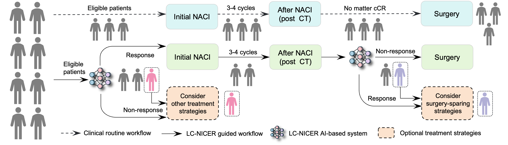
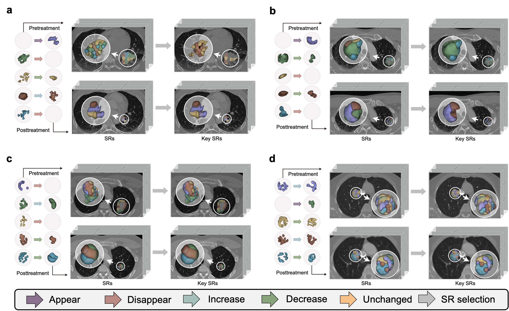
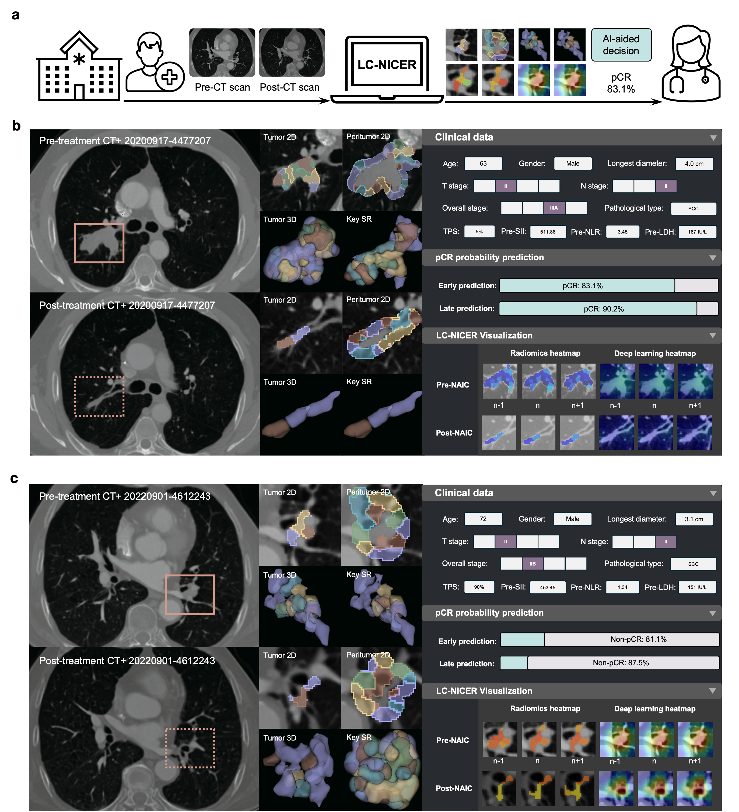
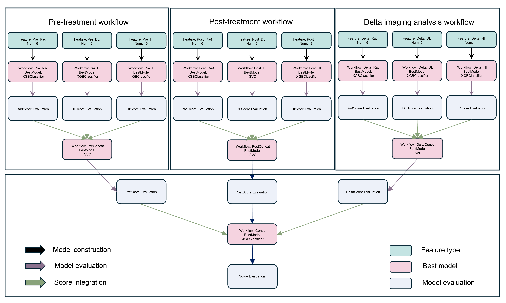

# Welcome to Lung Cancer Neo-adjuvant Immuno-Chemotherapy Response Predictor (LC-NICER)

The efficacy prediction of neoadjuvant chemoimmunotherapy (NACI) in lung cancer is critical for individualized treatment, yet current clinical biomarkers (e.g., PD-L1, RECIST 1.1) show limited predictive accuracy, largely due to the spatiotemporal heterogeneity of tumors during treatment evolution. To address this unmet need, our research team proposed a non-invasive AI tool (LC-NICER) for predicting NACI response in lung cancer. LC-NICER enables personalized therapeutic strategies, accelerates adaptive clinical trials, and optimizes treatment decisions, potentially reducing reliance on invasive procedures.

## Clinical Demand
Neoadjuvant chemoimmunotherapy (NACI) has transformed lung cancer management by enabling tumor downstaging and improving surgical resect ability. However, nearly 40% of patients derive no clinical benefit from NACI, enduring unnecessary toxicity and financial burden. While PD-L1 expression, endorsed by the FDA, is the primary biomarker for immunotherapy selection (5), its utility is hampered by tumor heterogeneity, sampling bias, and procedural complexity. These limitations underscore the urgent need for non-invasive, scalable tools to stratify patients and optimize therapeutic decisions across diverse clinical settings.

<p align="center">
  
</p>

## Key Features

We summarize the key contributions of this work in three-fold:

✔ **Foundation Model-Powered Feature Extraction** 
- A CT foundation model provides robust deep learning features, capturing latent tumor microenvironment patterns.
  
✔ **Multi-dimensional Heterogeneity Quantification**
- Radiomics (tumor texture), deep learning (microenvironmental context), and habitat imaging (subregional dynamics) features are synergistically combined to map spatiotemporal heterogeneity.
  
✔ **Dynamic Response Prediction**
- LC-NICERα (pre-treatment model) identifies early responders, while LC-NICERδ (combined pre-, post-, and delta-feature model) non-invasively predicts pCR, guiding surgical decisions.

## Habitat Imaging Analysis

As one of the main contribution, our team proposed a novel approach for habitat imaging analysis on radiological images (e.g., CT in this study). Our approach was employed to analyze the spatial heterogeneity of the tumor and its microenvironment using a multi-step pipeline. This approach provided a robust and interpretable framework for quantifying tumor microenvironment dynamics and their implications for treatment response. 

<p align="center">
  
</p>

## Clinical Application

The LC-NICER has the potential for clinical application, which is capable of distinguishing patients with/without benefit from NACI treatment. The main outputs of LC-NICER are as follows.

✔ **Probabiltiy of pCR calculated by LC-NICER** 
  
✔ **Key subregions of tumor and microenviroment**
  
✔ **Visualization of attentive resions by LC-NICER**

The following figure demonstrates the clinical applicability of the LC-NICERα (Pre-Model) and LC-NICERδ in predicting therapy response at both early and late stages of treatment. Beyond prediction accuracy, our AI-driven framework provides comprehensive visualizations to enhance clinical interpretability. These include subregion visualizations of the tumor and peritumoral regions (2D and 3D), highlighting key subregions (SRs) identified through their predictive importance. Additionally, feature heatmaps generated from radiomics and deep learning analyses are provided, with highlighted areas indicating suspicious non-pCR regions. These visualizations offer clinicians actionable insights into tumor heterogeneity and treatment response dynamics, supporting informed decision-making.

<p align="center">
  
</p>

## Usage
<!-- ✔ **Clone With Git-LFS**
```bash
# Make sure git-lfs is installed (https://git-lfs.com)
git lfs install
git clone https://github.com/zhenweishi/LC-NICER
``` -->
✔ **Clone Without Git-LFS** 
1. Clone the repository   
    ```bash
    git clone https://github.com/zhenweishi/LC-NICER
    ```
    <!-- ```bash
    # If you want to clone without large files - just their pointersb
    GIT_LFS_SKIP_SMUDGE=1 git clone https://github.com/zhenweishi/LC-NICER
    ``` -->
2. Download the [DL model](https://drive.google.com/file/d/1YS4Rdj8TkiJAIIrJHdWHtgX38sVcwUmW/view?usp=sharing) and put it in the `LC-NICER/configs/dl_feature_extraction/mae3d_lung_CT` folder
3. Download the [image.zip](https://drive.google.com/file/d/150M98JUQXkczCJAFGh2D7PXa4mYMGFFH/view?usp=sharing) and [mask.zip](https://drive.google.com/file/d/1pEwCC9EEui6f_GcmIuSe4edwpQk6cLBe/view?usp=sharing), unzip them and put them in the `LC-NICER/examples/test/` folder
  
✔ **Environment Setup**  
Ubuntu 24.04.1 LTS is tested for the environment.  
**Note**: Python 3.9.18 is required for the environment. Other versions may cause compatibility issues.  
```bash
conda create --name LCNICER python==3.9.18
conda activate LCNICER
cd LC-NICER
pip install -r requirements.txt
```

✔ **Detailed Usage**  
Check out our [Workflow Notebook](./examples/test/workflow.ipynb)



## Main Developers
 - [Dr. Zhenwei Shi](https://github.com/zhenweishi) <sup/>1, 2
 - [MSc. Zhitao Wei](https://github.com/kissablemt) <sup/>1, 2
 - MD. Guanchao Ye <sup/>3
 - [Dr. Chu Han](https://chuhan89.com) <sup/>1, 2
 - MD. Changhong Liang <sup/>1, 2
 - MD. Zaiyi Liu <sup/>1, 2
 
<sup>1</sup> Department of Radiology, Guangdong Provincial People's Hospital (Guangdong Academy of Medical Sciences), Southern Medical University, China <br/>
<sup>2</sup> Guangdong Provincial Key Laboratory of Artificial Intelligence in Medical Image Analysis and Application, China <br/>
<sup>3</sup> Department of Thoracic Surgery, the First Affiliated Hospital of Zhengzhou University, Zhengzhou, China <br/>

## Contact

📧 For collaboration inquiries, please contact Prof. Zhenwei Shi [Contact Email](shizhenwei@gdph.org.cn)


